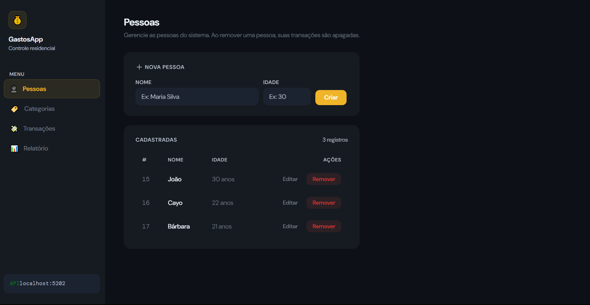
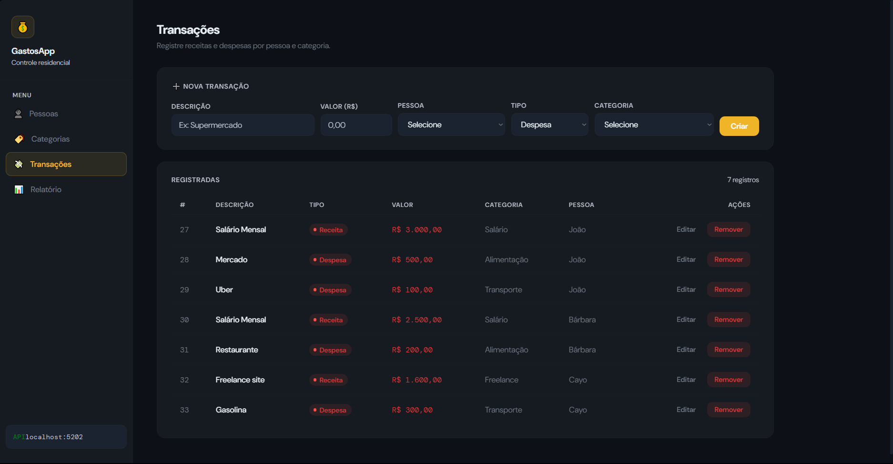
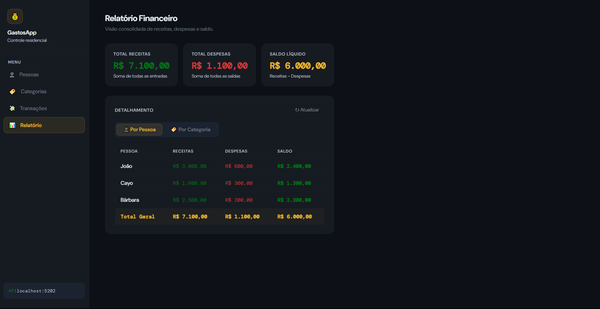

# Expense Manager — Sistema Full Stack de Controle Financeiro

Aplicação full stack para controle financeiro residencial, desenvolvida com ASP.NET Core Web API e React.  
O sistema permite gerenciamento de pessoas, categorias e transações, com relatórios consolidados e regras de negócio aplicadas no backend.

Este projeto foi desenvolvido com o objetivo de praticar arquitetura full stack utilizando ASP.NET Core e React, aplicando padrões e práticas comuns em aplicações reais.

---

## Demonstração

Vídeo demonstrando o funcionamento da aplicação.

<p align="center">
  <a href="https://youtu.be/j56Fc0FuZ6E">
    
  </a>
</p>

<p align="center">
  
</p>

## Tecnologias

### Backend

| Tecnologia | Versão |
|-----------|----------|
| .NET | 10 |
| ASP.NET Core Web API | 10 |
| Entity Framework Core | 10 |
| SQLite | — |
| Swagger / Swashbuckle | — |

### Frontend

| Tecnologia | Versão |
|-----------|----------|
| React | 19 |
| TypeScript | 5 |
| Vite | 6 |
| Axios | — |
| React Router DOM | 6 |

### Conceitos aplicados

- API REST
- DTO Pattern
- Separação de responsabilidades
- Migrations com Entity Framework
- Cascade delete / Restrict delete
- Consultas com AsNoTracking
- Requisições paralelas com Promise.all
- Estrutura em camadas

---

## Funcionalidades

### Pessoas

- Cadastro, edição, listagem e remoção
- Exclusão em cascata das transações vinculadas

### Categorias

- Finalidade: Receita / Despesa / Ambas
- Exclusão bloqueada quando há transações associadas

### Transações

- Registro de receitas e despesas
- Validação de regras de negócio no backend
- Filtro automático de categorias conforme o tipo da transação

### Relatórios

- Totais por pessoa
- Totais por categoria
- Saldo geral

---

## Arquitetura

Estrutura em camadas no backend:

```
Controllers → DTOs → Models → Data (DbContext)
```

Organização do frontend:

```
pages / components / services / types / routes
```

Princípios utilizados:

- Separação entre Models e DTOs
- Validação centralizada no backend
- API REST padronizada
- Consultas otimizadas com AsNoTracking
- Banco gerenciado por migrations

---

## Estrutura do projeto

```
/
├── Backend/
│   ├── Controllers/
│   ├── Models/
│   ├── DTOs/
│   ├── Data/
│   ├── Migrations/
│   └── Program.cs
│
└── frontend/
    └── src/
        ├── components/
        ├── pages/
        ├── services/
        ├── types/
        └── routes/
```

---

## Como executar

### Pré-requisitos

- .NET SDK 10+
- Node.js 18+

### Backend

```bash
cd Backend

dotnet restore
dotnet ef database update
dotnet run
```

Swagger:

```
http://localhost:5202/swagger
```

### Frontend

```bash
cd frontend

npm install
npm run dev
```

```
http://localhost:5173
```

Certifique-se de que o backend esteja em execução antes de iniciar o frontend.

---

## Principais endpoints

| Método | Rota | Descrição |
|--------|--------|-------------|
| GET | /api/pessoa | Lista pessoas |
| POST | /api/pessoa | Cria pessoa |
| GET | /api/categoria | Lista categorias |
| POST | /api/transacao | Cria transação |
| GET | /api/relatorio/totais-por-pessoa | Relatório |
| GET | /api/relatorio/totais-por-categoria | Relatório |

---

## Modelo de dados

Pessoa  
Categoria  
Transacao  

Relacionamentos:

Pessoa → Transacoes (Cascade)  
Categoria → Transacoes (Restrict)

---

## Screenshots

<p align="center">
  
</p>

<p align="center">
  
</p>

<p align="center">
  
</p>

---

## Decisões técnicas

- Uso de DTOs para evitar over-posting
- Cascade delete configurado no banco
- Restrict delete para manter integridade
- IgnoreCycles no serializer JSON
- AsNoTracking para consultas de leitura
- Promise.all no frontend
- Separação entre frontend e backend
- Estrutura preparada para crescimento

---

## Objetivo

Projeto desenvolvido para aprimorar habilidades em desenvolvimento full stack com .NET e React, aplicando práticas utilizadas em sistemas reais.

---

## Autor

Cayo Fellipe  
Desenvolvedor de Software  
Backend / .NET / APIs / React

LinkedIn: https://www.linkedin.com/
